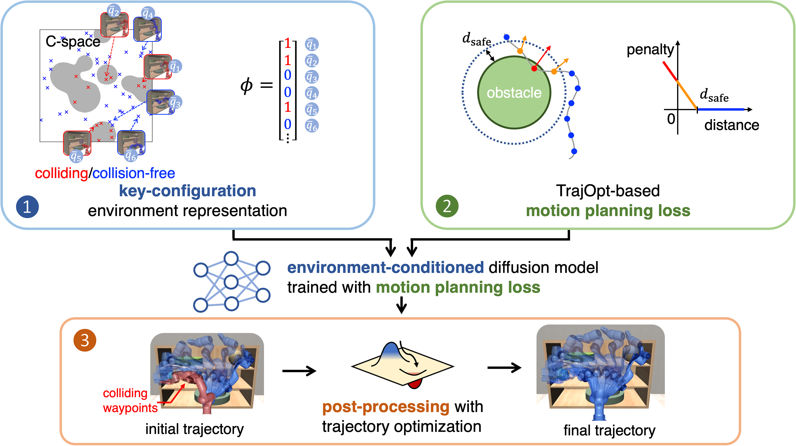

# PRESTO: Fast Motion Planning Using Diffusion Models Based on Key-Configuration Environment Representation
[Mingyo Seo](https://mingyoseo.com)&ast;, [Yoonyoung Cho](https://yycho0108.github.io/research)&ast;, [Yoonchang Sung](https://yoonchangsung.com/), [Peter Stone](https://www.cs.utexas.edu/~pstone/), [Yuke Zhu](https://www.cs.utexas.edu/~yukez)&dagger;, [Beomjoon Kim](https://beomjoonkim.github.io/)&dagger;

[Project](https://kiwi-sherbet.github.io/PRESTO) | [arXiv](https://arxiv.org/abs/2409.16012)



## Abstract
We introduce a learning-guided motion planning framework that generates seed trajectories using a diffusion model for trajectory optimization. Given a workspace, our method approximates the configuration space (C-space) obstacles through an environment representation consisting of a sparse set of task-related key configurations, which is then used as a conditioning input to the diffusion model. The diffusion model integrates regularization terms that encourage smooth, collision-free trajectories during training, and trajectory optimization refines the generated seed trajectories to correct any colliding segments. Our experimental results demonstrate that high-quality trajectory priors, learned through our C-space-grounded diffusion model, enable the efficient generation of collision-free trajectories in narrow-passage environments, outperforming previous learning- and planning-based baselines.

If you find our work useful in your research, please consider [citing](#citing).


## Dependencies
- Python 3.9.2 (recommended)
- [PyTorch](https://github.com/pytorch/pytorch)
- [cuRobo 0.7.0](https://github.com/NVlabs/curobo/tree/v0.7.0)
- [Robosuite  1.4.1](https://github.com/ARISE-Initiative/robosuite/tree/v1.4.1) (optional)


## Related Repositories
The implementation of the simulated environment is based on [LEGATO](https://github.com/UT-HCRL/LEGATO), and the Bi-RRT baseline in the main manuscript is based on [motion-planner](https://github.com/caelan/motion-planners).


## Usage
Please see [Setup](docs/setup.md) and [Usage](docs/usage.md).


## Dataset and Pre-trained Models
We provide our training and evaluation dataset, model, and relevant assets, available at [this](https://huggingface.co/datasets/dmp2023/presto-data/tree/main) Hugging Face repo.


## Citing
```
@inproceedings{seo2024presto,
   title={PRESTO: Fast Motion Planning Using Diffusion Models Based on 
      Key-Configuration Environment Representation},
   author={Seo, Mingyo and Cho, Yoonyoung and Sung, Yoonchang and Stone, Peter
      and Zhu, Yuke and Kim, Beomjoon},
   booktitle={IEEE International Conference on Robotics and Automation (ICRA)},
   year={2025},
}
```
